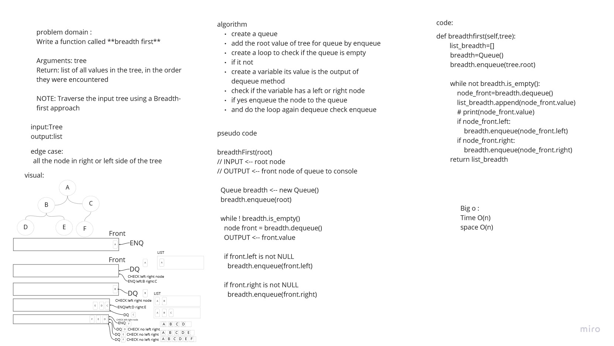
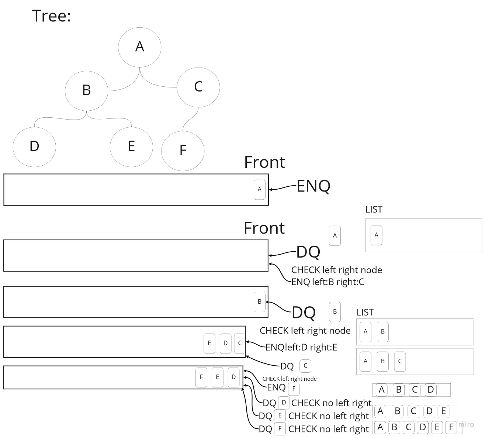

# Challenge Summary
<!-- Description of the challenge -->

Write a function called **breadth first**

Arguments: tree
Return: list of all values in the tree, in the order they were encountered

NOTE: Traverse the input tree using a Breadth-first approach

## Whiteboard Process
<!-- Embedded whiteboard image -->

## Approach & Efficiency
<!-- What approach did you take? Why? What is the Big O space/time for this approach? -->
for the breadth function i use while loop to traverse inside the tree and a list to return the result
so the time complixisty will be O(n) since i used one loop
and for the space complixisty O(n) since i used a list
for queue data at the end of the procese it will be empty  

## Solution
<!-- Show how to run your code, and examples of it in action -->
creating a queue
then adding the root value of tree in queue by enqueue method,after that
creating a loop to check if the queue is empty or not
if its not
create a variable its value is the output of dequeue method for queue
**check** if the node has a left or right node
if yes **enqueue** the node to the queue
and do the loop again **dequeue** **check** **enqueue**

