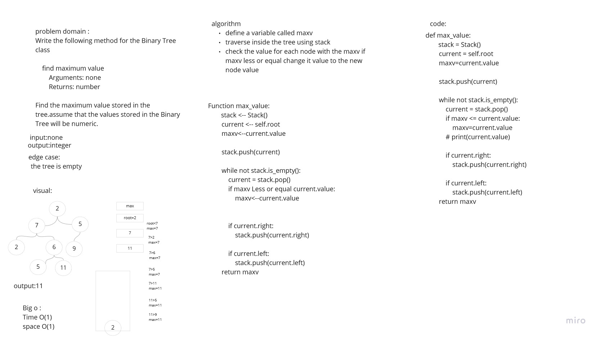

# Challenge Summary
<!-- Description of the challenge -->
Write the following method for the Binary Tree class

    find maximum value
        Arguments: none
        Returns: number

Find the maximum value stored in the tree.assume that the values stored in the Binary Tree will be numeric.

## Whiteboard Process
<!-- Embedded whiteboard image -->

## Approach & Efficiency
<!-- What approach did you take? Why? What is the Big O space/time for this approach? -->
useing a stack to travers inside the tree by pushing the node and poping it using a while loop 
so the time complixity is O(n)
for the space complixity is O(1) since i pop and push node each time

## Solution
<!-- Show how to run your code, and examples of it in action -->
using a stack to traverse inside the tree using the post-order method so by creating two variable one to store the root and traverse inside the tree and a variable two store the maximum value in tree 
so creating a loop it will stop when the stack is empty 
first i wil push the root to stack then pop it in the while and check if the max variable is less than the pop value if it true i will change the max variable to the new variable and so on until the stack is empty 
