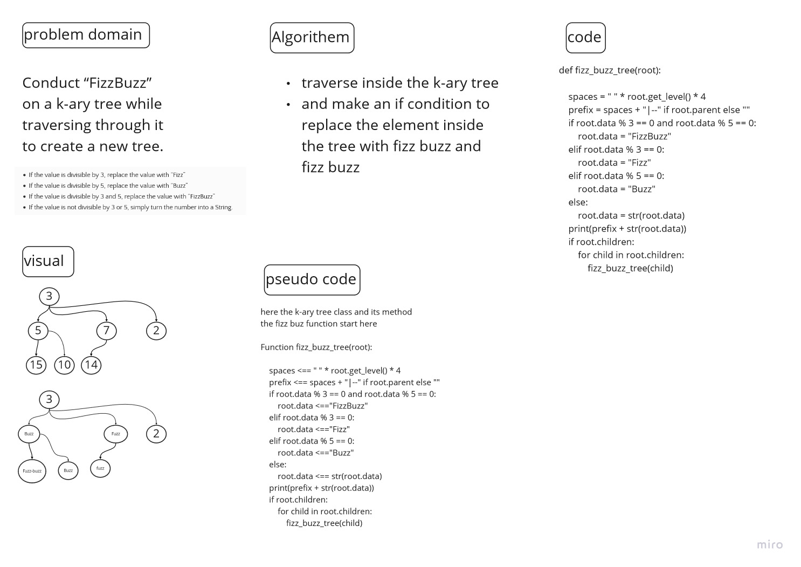

# Challenge Summary
<!-- Description of the challenge -->
Conduct “FizzBuzz” on a k-ary tree while traversing through it to create a new tree

    If the value is divisible by 3, replace the value with “Fizz”
    If the value is divisible by 5, replace the value with “Buzz”
    If the value is divisible by 3 and 5, replace the value with “FizzBuzz”
    If the value is not divisible by 3 or 5, simply turn the number into a String.

## Whiteboard Process
<!-- Embedded whiteboard image -->

## Approach & Efficiency
<!-- What approach did you take? Why? What is the Big O space/time for this approach? -->
traverse inside the k-ary tree
and make an if condition to replace the element inside the tree with fizz buzz and fizz buzz
the space complexity is o(n) since i used list to save the tree element onside it 
and for time complexity i used recursive function so its o(n)

## Solution
<!-- Show how to run your code, and examples of it in action -->

so it will traverse the k-ary tree and check each element inside it

If the value is divisible by 3, replace the value with “Fizz”

If the value is divisible by 5, replace the value with “Buzz”

If the value is divisible by 3 and 5, replace the value with “FizzBuzz”

If the value is not divisible by 3 or 5, simply turn the number into a String.
