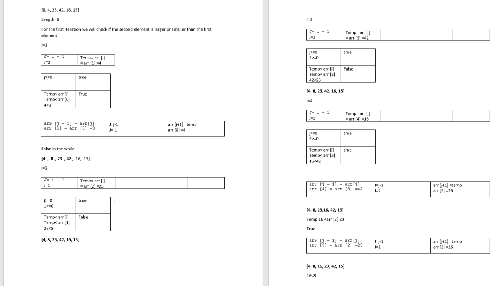
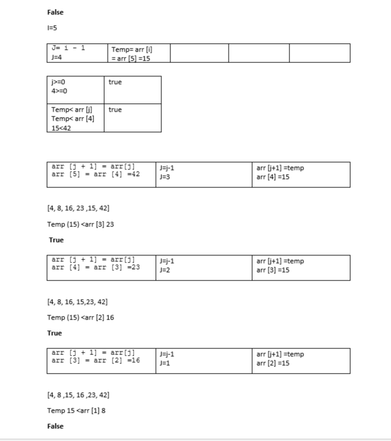

# Challenge Summary
<!-- Description of the challenge -->
sort array from minimum value to the max value

input :array

output: array with ascending arrange for it s value

## Whiteboard Process
<!-- Embedded whiteboard image -->

## Approach & Efficiency
<!-- What approach did you take? Why? What is the Big O space/time for this approach? -->
use two loop one for the temp variable and another loop for the element behind the temp variable and each time the temp variable is less the the previous element i switch there position and check again 
so the big o for time is O(n^2)
and for space is o(1) since i change on the same array 

## Solution
<!-- Show how to run your code, and examples of it in action -->

-	Make two pointer one for the first element and another pointer for the element behind this element 
-	So, we create a loop point to an element in the array then check if the element behind it lower so continue for the next element 
-	Else we create another while loop to switch the two element and then check if the element behind our element in its new position less than it or not if not, we will its position and check again  

## test 

