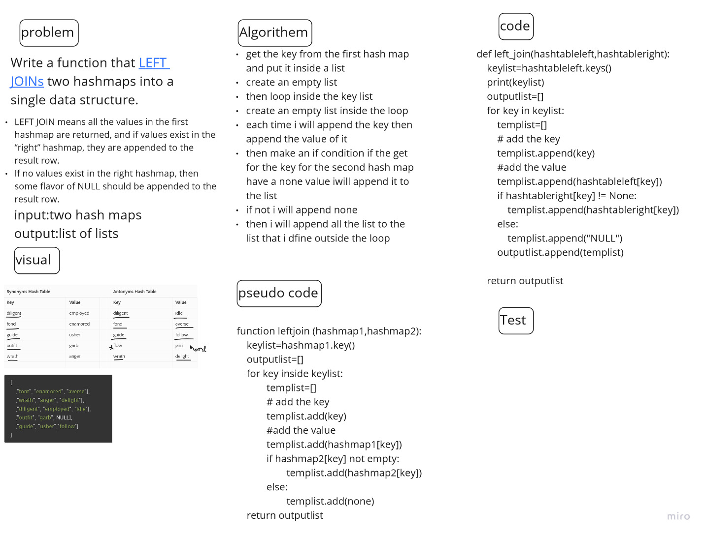

# Challenge Summary
<!-- Description of the challenge -->

Write a function that LEFT JOINs two hashmaps into a single data structure.

- LEFT JOIN means all the values in the first hashmap are returned, and if values exist in the “right” hashmap, they are appended to the  result row.
- If no values exist in the right hashmap, then some flavor of NULL should be appended to the result row.

## Whiteboard Process
<!-- Embedded whiteboard image -->

## Approach & Efficiency
<!-- What approach did you take? Why? What is the Big O space/time for this approach? -->
the big O for time is a o(n) since i used a for loop to move inside the key list
for space its O (n) since i used a list to store the output

## Solution
<!-- Show how to run your code, and examples of it in action -->
In simple sentence my solution run as below :

- get the key from the first hash map and put it inside a list
- create an empty list
- then loop inside the key list
- create an empty list inside the loop templist
- each time it will append the key then append the value of it to templist
- then make an if condition inside the loop if the get for the key for the second hash map have a none value it will append it to the templist
- if not it will append none to templist
- then it will append the templist to the list that i define outside the loop 
- after finishing the for loop it will  return the output list