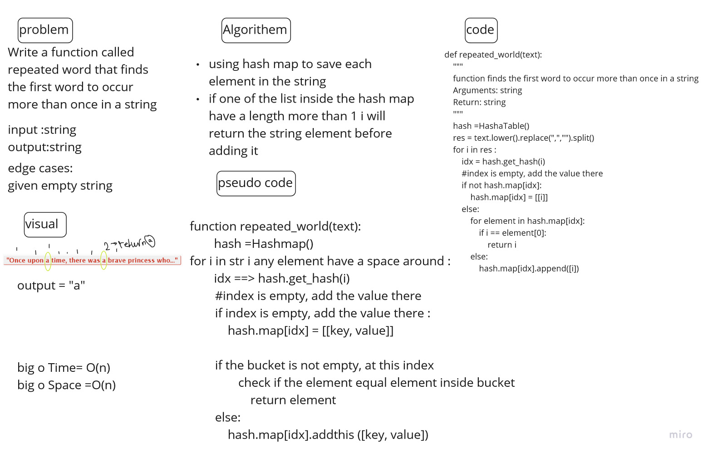

# Challenge Summary
<!-- Description of the challenge -->
Write a function called repeated word that finds the first word to occur more than once in a string

## Whiteboard Process
<!-- Embedded whiteboard image -->

## Approach & Efficiency
<!-- What approach did you take? Why? What is the Big O space/time for this approach? -->
the big O for time is a o(n) since i used a for loop to move inside the splited string
for space its O (n) since i used a hash table

## Solution
<!-- Show how to run your code, and examples of it in action -->
the function used hash map to save each world inside the string
if one of the list inside the hash map have a length more than 1 i will chech the elment if its match any element inside the list if yes i will return the string element if not i will add it and continue the loop

link: <https://github.com/ahmadjaara/data-structures-and-algorithms/tree/main/hashTable>
