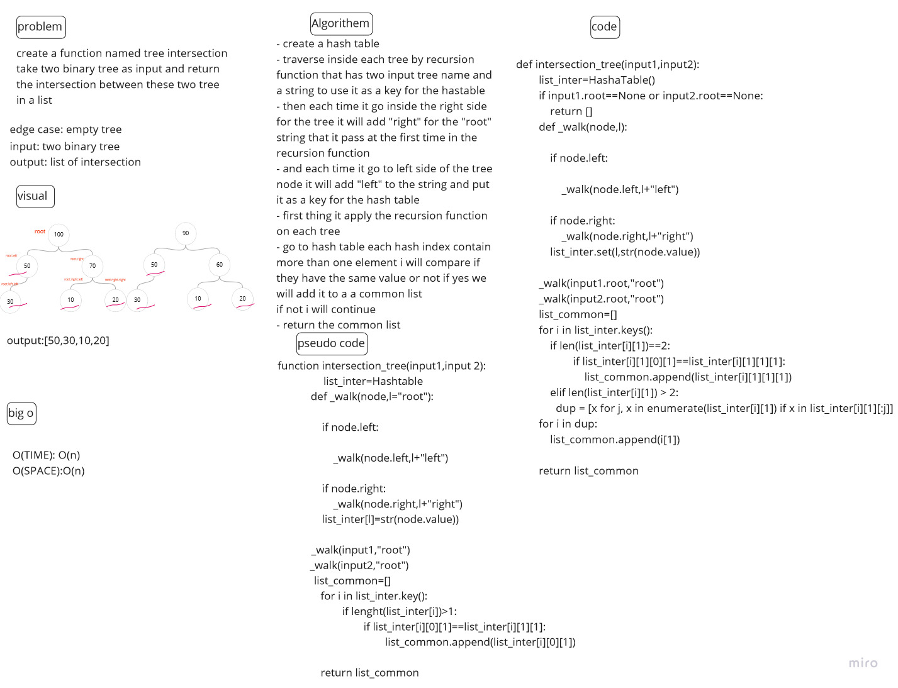

# Challenge Summary
<!-- Description of the challenge -->
create a function named tree intersection
take two binary tree as input and return the intersection between these two tree in a list

## Whiteboard Process
<!-- Embedded whiteboard image -->

## Approach & Efficiency
<!-- What approach did you take? Why? What is the Big O space/time for this approach? -->
traverse inside each tree by recursion function that has two input tree name and a string to use it as a key for the hastable

in the recursion function each time it go inside a right it will add "right" for the "root" string that it pass it at the first time
and each time it go to left side it will add "left" to the root string and put it as a key for the hash table
apply the recursion function on each tree
then in each hash index contain more than one element i will compare if they have the same value or not if yes it will add it to a list contain the common node
if not i will continue

`The big o for time is O(n) since the code use recursion function twice and a two for loop`

`for the space it is also O(n) since it used a hash table`

## Solution
<!-- Show how to run your code, and examples of it in action -->
- create a hash table

- traverse inside each tree by recursion function that has two input tree name and a string to use it as a key for the hastable

- then each time it go inside the right side for the tree it will add "right" for the "root" string that it pass at the first time in the recursion function

- and each time it go to left side of the tree node it will add "left" to the string and put it as a key for the hash table

- first thing it apply the recursion function on each tree

- go to hash table each hash index contain more than one element i will compare if they have the same value or not if yes we will add it to a a common list
if not i will continue

- return the common list

<https://github.com/ahmadjaara/data-structures-and-algorithms/tree/main/hashTable>
