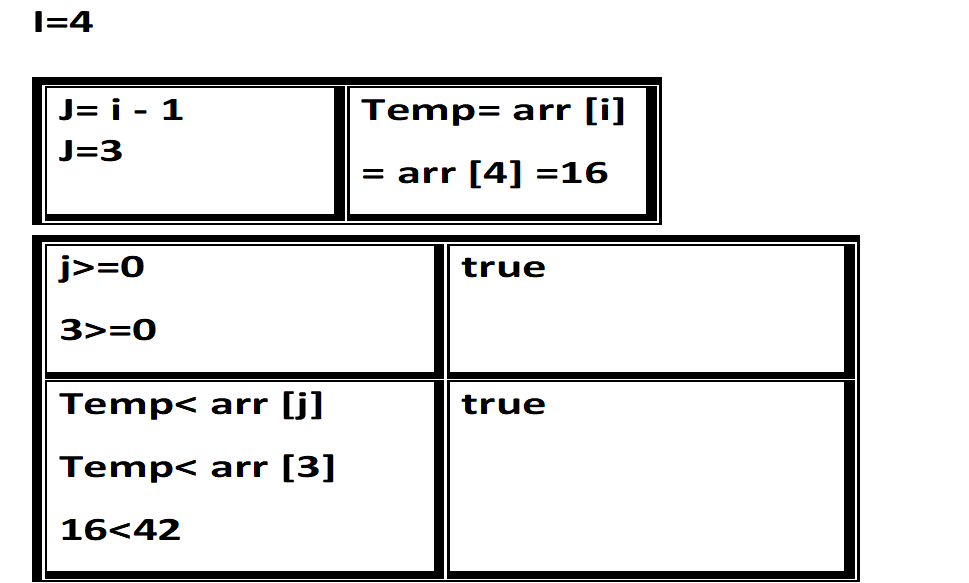

# Insertion Sort

Insertion sort is a simple sorting algorithm that assort an array element in ascending  manner

## Pseudocode

  InsertionSort(int[] arr)

    FOR i = 1 to arr.length

      int j <-- i - 1
      int temp <-- arr[i]

      WHILE j >= 0 AND temp < arr[j]
        arr[j + 1] <-- arr[j]
        j <-- j - 1

      arr[j + 1] <-- temp

## Tracing

Input array: [8,4,23,42,16,15]
Expected output array : [4, 8, 15, 16, 23, 42]

### Pass 1

in the first pass for the **for** loop the function store the second value in the array in the **temp** variable

in the **while** loop since the condition is true (j>=0 and the temp < than the first element) it will switch the position between the two element the first (element before temp) and the second element (temp variable)
then it checks the while loop condition again but the (j=-1) so the condition is false

result out of this pass is`[4, 8,23,42,16,15]`

### Pass 2

in the second pass for the **for** loop the function store the third value in the array in the **temp** variable

in the **while** loop since the condition is false (j>=0 and the temp not < than the first element)
so it will not go inside the while loop

result of this pass  `[4, 8,23,42,16,15]`

### Pass 3

in the third pass for the **for** loop the function store the forth value in the array in the **temp** variable

in the **while** loop since the condition is false (j>=0 and the temp not < than the first element)
so it will not go inside the while loop

result of this pass  `[4, 8,23,42,16,15]`

### Pass 4

in the forth pass for the **for** loop the function store the fifth value in the array in the **temp** variable

in the **while** loop since the condition is True so it will make the switch between the two position of temp element and the elemnt before it then it will check again the element before the temp it is larger than it so it will make the switch again
then it will check the condition again its false

result of this pass `[4, 8,16,23,42,15]`

### Pass 5

in the forth pass for the **for** loop the function store the sixth value in the array in the **temp** variable

in the **while** loop since the condition is True so it will make the switch between the two position of temp element and the elemnt before it`(result at this point [4, 8, 16, 23 ,**15** temp , 42])`then it will check again the element before the temp it is larger than it so it will make the switch again `(result at this point [4, 8, 16, **15** temp,23, 42])`
then it will check the condition again its true so it will switch the elements position `(result at this point [4, 8 ,**15** temp, 16 ,23, 42])`
then the condition become false

result of this pass  `[4, 8, 15, 16, 23, 42]`

## Efficency

Time: O(n^2)
    The basic operation of this algorithm is comparison. This will happen n * n number of times
Space: O(1)
    No additional space is being created.
