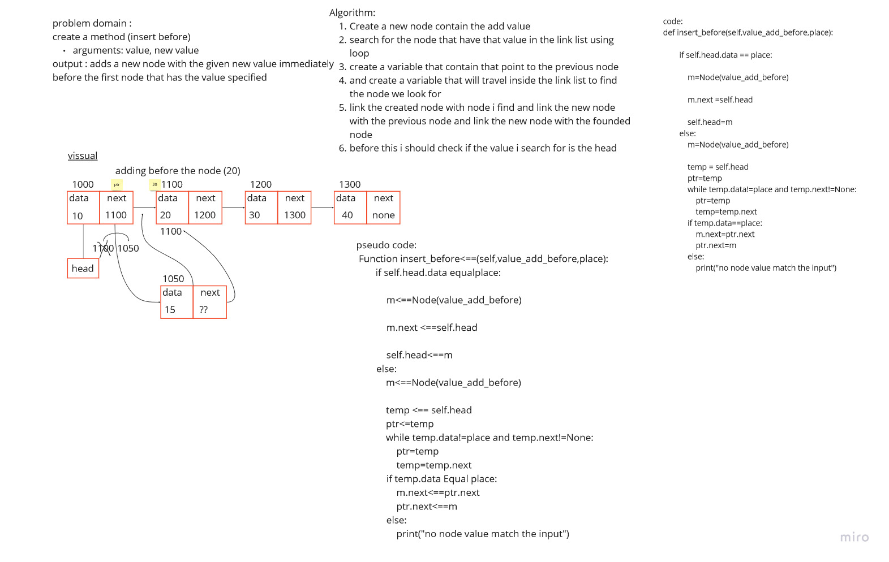

# Singly Linked List
<!-- Short summary or background information -->
A singly linked list is a type of linked list that is unidirectional, that is, it can be traversed in only one direction from head to the last node (tail).

Each element in a linked list is called a node. A single node contains data and a pointer to the next node which helps in maintaining the structure of the list.

"defenetion from educative website"

## Challenge
<!-- Description of the challenge -->
create a linklist data structure and
add a method to display all the data inside the linklist and a method to insert node at the begining of the linklist and a method to search inside for an element inside the linklist
and other method like insert node after and before
node insde the linklist and a method to search for
the K(index) for the node data

"
challenge feature :

Node

    Create a Node class that has properties for the value stored in the Node, and a pointer to the next Node.

Linked List

    Create a Linked List class
    Within your Linked List class, include a head property.
    Upon instantiation, an empty Linked List should be created.

"

## Feature Tasks

Write the following methods for the Linked List class:

- insert

    Arguments: value
    Returns: nothing
    Adds a new node with that value to the head of the list with an O(1) Time performance.

- includes

    Arguments: value
    Returns: Boolean
    Indicates whether that value exists as a Node’s value somewhere within the list.

- to string

    Arguments: none
    Returns: a string representing all the values in the Linked List, formatted as:
    "{ a } -> { b } -> { c } -> NULL"

- append method

    arguments: new value
    adds a new node with the given value to the end of the list

- insert before method

    arguments: value, new value
    adds a new node with the given new value immediately before the first  node that has the value specified

- insert after method

    arguments: value, new value
    adds a new node with the given new value immediately after the first node that has the value specified

- search k elemnet (kthFromEnd) method

    argument: a number, k, as a parameter.
    Return the node’s value that is k places from the tail of the linked list.

## Approach & Efficiency
<!-- What approach did you take? Why? What is the Big O space/time for this approach? -->
- for **insert method** after the head i use a `o(1)` since here i just move one step and link the new node with head node and the space big O is `o(1)` since i add one node at the exist link list

- for **display/search_ele/tostring** methods i use a loop to do the functionality for these methods so it is `o(n)` since i firstly move inside the link list until i reach the none node so i move the number of node inside the link list
the space big O is `o (1)`

- for the **append/insert before/insert after method** the big o is
`o(n)` since here also i use a loop to move inside the link list untile i fid the data value i search for and i add the noce at it
the space is `O(1)` since i just add a new node for the same link list

- for the **kthFromEnd** i use two loop one to calculate the length of the linklist and another one for search for the k element so the big o notation for time is `O(n)` (LOOP1+LOOP2=n+n=2n~~>n)
for space `O(1)` just add a variables .

## API
<!-- Description of each method publicly available to your Linked List -->

- insert_begining method :

    Arguments: data
    Adds a new node with value to the head of the list with an O(1) Time performance.

- search_ele method:

    Arguments: value to search for it inside the linklist
    Returns: Boolean
    Indicates whether that value exists as a Node  value somewhere within the list.

- display method:

    its a method to print the collecation for all the element inside the linked list

- to_string(self):

    Returns: a string representing all the values in the Linked List, formatted as:
    "{ a } -> { b } -> { c } -> NULL"
- append_linklist(self,value_add)

    add a node at the end of the link list
    input a data for the node that will add
    output a node placed at the end of link list

- insert_after(self,value_add_after,place):

    add a node at after a specific node value in the link list
    input a data for the node that will add and
    the place (which is the value of the node that i will add the new node after it)
    output a node placed after a specific node in the link list
- insert_before(self,value_add_before,place):

    add a node at before a specific node value in the link list
    input a data for the node that will add and
    the place (which is the value of the node that i will add the new node before it)
    output a node placed before a specific node in the link list
- kthFromEnd

    method for searching for the K th  element in the linklist which k start from the tail of the linklist,
    input: k to determine the index for the node
    output: the data or value of the K node.

## white board  

