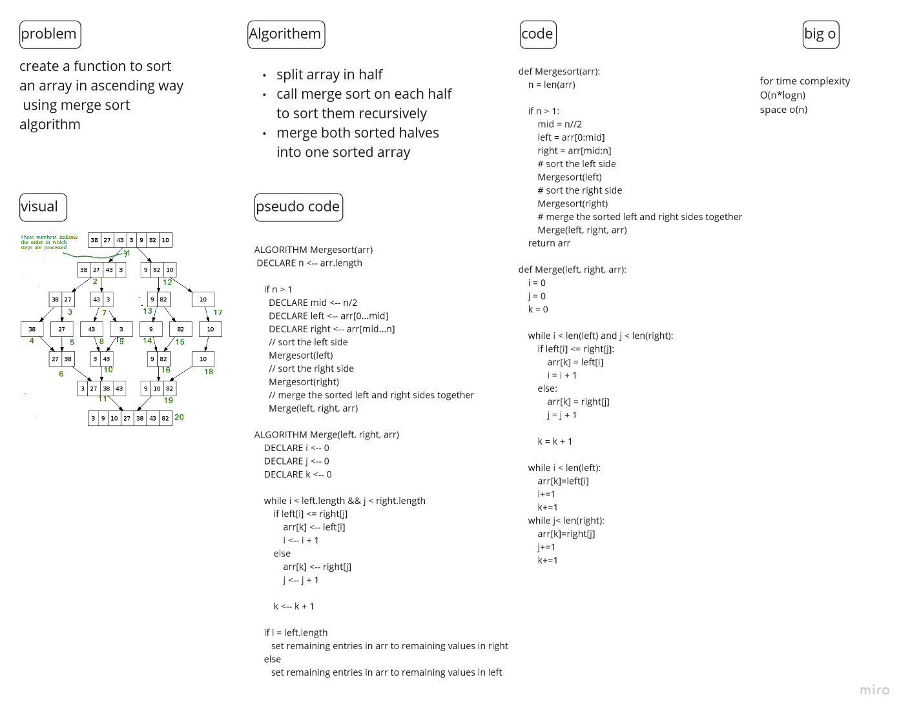

# Challenge Summary
<!-- Description of the challenge -->
create a function to sort an array in ascending way
using merge sort algorithm

## Whiteboard Process
<!-- Embedded whiteboard image -->

## Approach & Efficiency
<!-- What approach did you take? Why? What is the Big O space/time for this approach? -->
- split array in half
- call merge sort on each half to sort them recursively
- merge both sorted halves into one sorted array
big o
time (O(n*log(n))) since i use recursive with loop 
space (o(n)) create two new array left and right 

## Solution
<!-- Show how to run your code, and examples of it in action -->
having two function one for splitting and the other one for merging the the array so in the first function we split the array until i have an array with one element and i did that recursively
and then merge these array using another function and rebuilt the array by compairing the element value and merge the element into the array  
