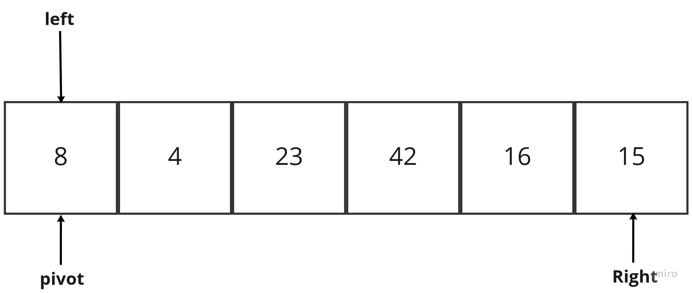
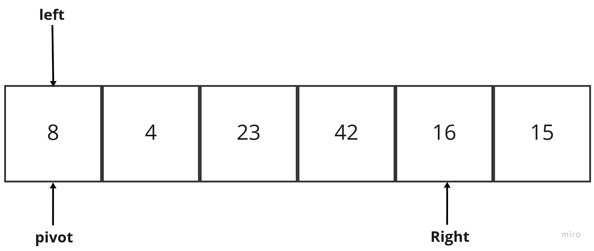
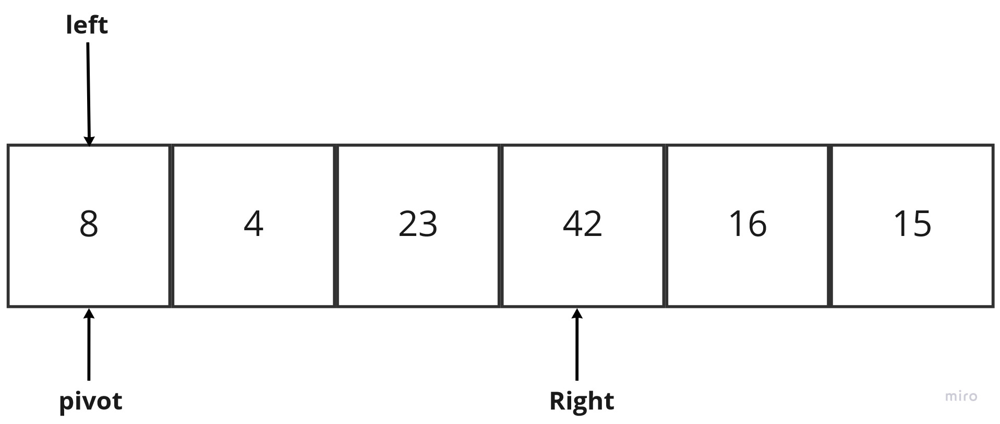
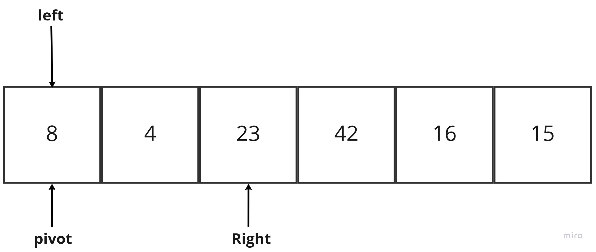
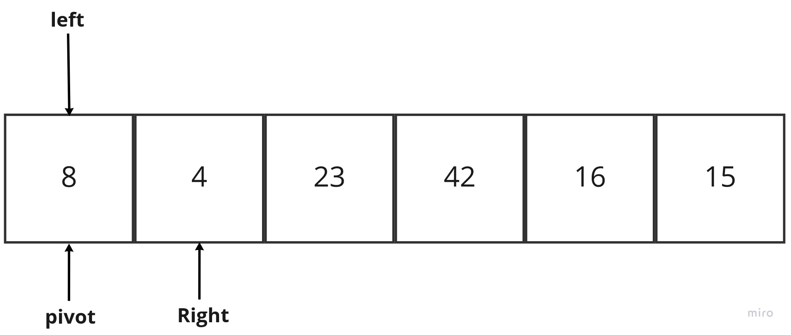
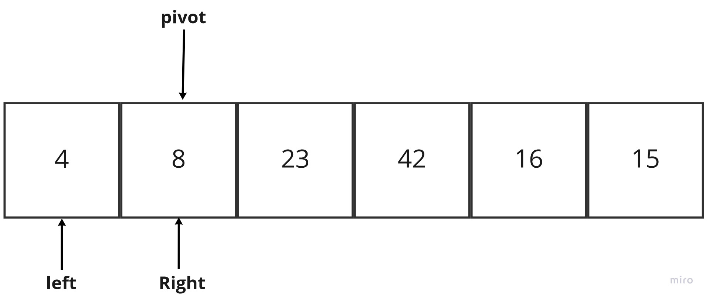
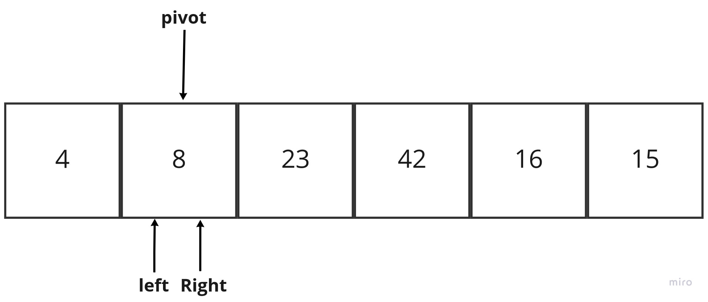
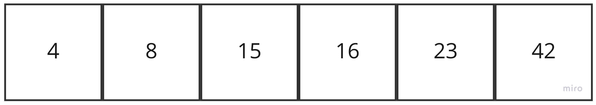

<!-- ALGORITHM QuickSort(arr, left, right)
    if left < right
        // Partition the array by setting the position of the pivot value
        DEFINE position <-- Partition(arr, left, right)
        // Sort the left
        QuickSort(arr, left, position - 1)
        // Sort the right
        QuickSort(arr, position + 1, right)

ALGORITHM Partition(arr, left, right)
    // set a pivot value as a point of reference
    DEFINE pivot <-- arr[right]
    // create a variable to track the largest index of numbers lower than the defined pivot
    DEFINE low <-- left - 1
    for i <- left to right do
        if arr[i] <= pivot
            low++
            Swap(arr, i, low)

     // place the value of the pivot location in the middle.
     // all numbers smaller than the pivot are on the left, larger on the right.
     Swap(arr, right, low + 1)
    // return the pivot index point
     return low + 1

ALGORITHM Swap(arr, i, low)
    DEFINE temp;
    temp <-- arr[i]
    arr[i] <-- arr[low]
    arr[low] <-- temp -->
# Challenge Summary

trace the algorithm for the quick sort methed by stepping through the process with the provided sample array. Document your explanation by creating a blog article that shows the step-by-step output after each iteration through some sort of visual.

# Quick Sort Algorithem

Quick sort is a highly efficient sorting algorithm and is based on partitioning of array of data into smaller arrays. A large array is partitioned into two arrays one of which holds values smaller than the specified value, say pivot, based on which the partition is made and another array holds values greater than the pivot value.

Quicksort partitions an array and then calls itself recursively twice to sort the two resulting subarrays.

## partition

`Target of partitions is, given an array and an element x of array as pivot, put x at its correct position in sorted array and put all smaller elements (smaller than x) before x, and put all greater elements (greater than x) after x`

`The logic is simple, we start from the leftmost element and keep track of index of smaller (or equal to) elements as i. While traversing, if we find a smaller element, we swap current element with arr[i]. Otherwise we ignore current element.`

## Pesodo code

    ALGORITHM QuickSort(arr, left, right)
        if left < right
            // Partition the array by setting the position of the pivot value
            DEFINE position <-- Partition(arr, left, right)
            // Sort the left
            QuickSort(arr, left, position - 1)
            // Sort the right
            QuickSort(arr, position + 1, right)

    ALGORITHM Partition(arr, left, right)
        // set a pivot value as a point of reference
        DEFINE pivot <-- arr[right]
        // create a variable to track the largest index of numbers lower than the defined pivot
        DEFINE low <-- left - 1
        for i <- left to right do
            if arr[i] <= pivot
                low++
                Swap(arr, i, low)

        // place the value of the pivot location in the middle.
        // all numbers smaller than the pivot are on the left, larger on the right.
        Swap(arr, right, low + 1)
        // return the pivot index point
        return low + 1

    ALGORITHM Swap(arr, i, low)
        DEFINE temp;
        temp <-- arr[i]
        arr[i] <-- arr[low]
        arr[low] <-- temp

## Trace code

arr= [8,4,23,42,16,15]

In the given array, we consider the leftmost element as pivot. So, in this case, a[left] = 8, a[right] = 15 and a[pivot] = 8 .
Since, pivot is at left, so algorithm starts from right and move towards left (to pivot side).

Now, a[pivot] < a[right], so algorithm moves forward one position towards left

Now, a[left] = 8, a[right] = 16, and a[pivot] = 8.
a[pivot] 8 < a[right] 16, so algorithm moves forward one position towards left

Now, a[left] = 8, a[right] = 42, and a[pivot] = 8.
a[pivot] 8 < a[right] 42, so algorithm moves forward one position towards left

Now, a[left] = 8, a[right] = 23, and a[pivot] = 8.
a[pivot] 8 < a[right] 23, so algorithm moves forward one position towards left

Now, a[left] = 8, a[right] = 4, and a[pivot] = 8.
Because, a[pivot] > a[right], so, algorithm will swap a[pivot] with a[right], and pivot moves to right

Now, a[left] = 4, a[right] = 8, and a[pivot] = 8.
As a[pivot] < a[left], so algorithm moves one position to

Now, a[pivot] = 8, a[left] = 8, and a[right] = 8. So, pivot, left and right are pointing the same element. It represents the termination of  procedure.

Element 8, which is the pivot element is placed at its exact position.
Elements that are right side of element 8 are greater than it, and the elements that are left side of element 8 are smaller than it.
Now, in a similar manner, quick sort algorithm is separately applied to the left and right sub-arrays. After sorting gets done, the array will  be -

## Big O

### **Time**

Average Case O(n*logn)

It occurs when the array elements are in jumbled order that is not properly ascending and not properly descending. The average case time complexity of quicksort is O(n*logn)
since it used a recursion function that it used inside it a for loop `n(for loop)*log(n)(for recursion)(* since they are inside each other)`

### **Space**

O(n*logn)
since it used a recursion function that used stack to save the operation inside it until it executed

## white boared

<https://github.com/ahmadjaara/data-structures-and-algorithms/tree/main/quick-sort>
