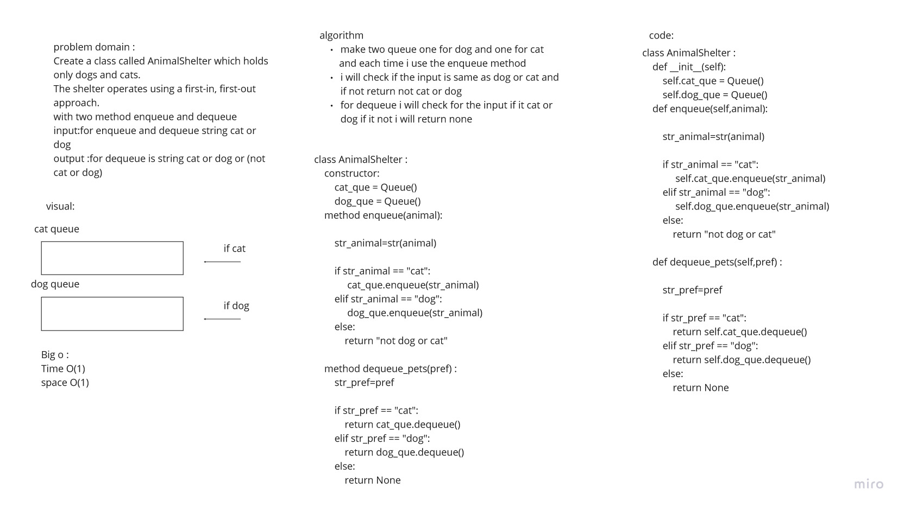

# Challenge Summary
<!-- Description of the challenge -->
Create a class called AnimalShelter which holds only dogs and cats.
The shelter operates using a first-in, first-out approach.
with two method enqueue and dequeue

## Whiteboard Process
<!-- Embedded whiteboard image -->

## Approach & Efficiency
<!-- What approach did you take? Why? What is the Big O space/time for this approach? -->
The big o for time is O(1) for each the dequeue and enqueue since I dont use any loop 

## Solution
<!-- Show how to run your code, and examples of it in action -->
I construct two queue one for cat and one for dog and each time I enqueue a pets the code will check 
if it cat or dog and add each pet for its queue 
and for dequeue I check for the input if it cat or dog and if its not it return none
