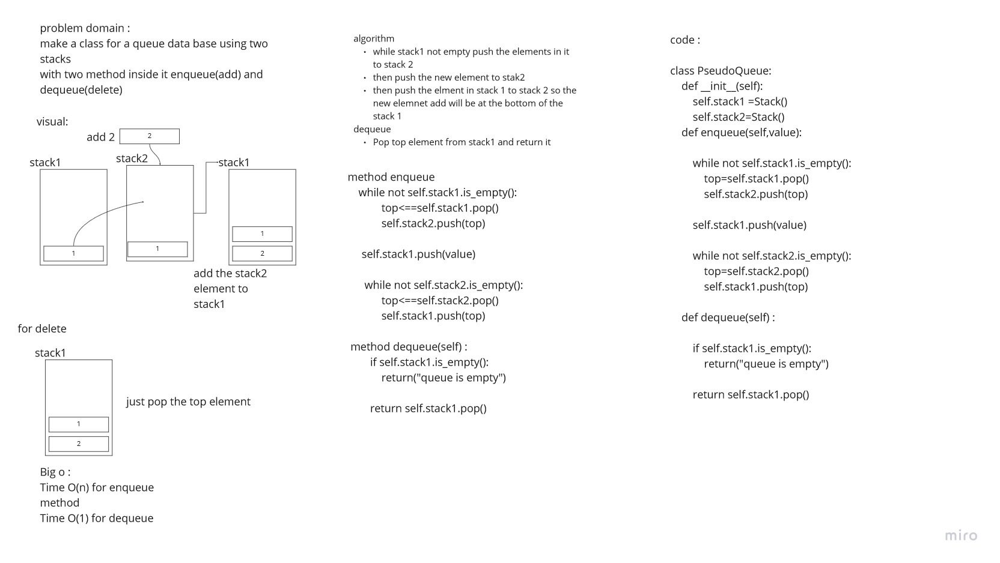

# Challenge Summary
<!-- Description of the challenge -->

make a class for a queue data base using two stacks
with two method inside it enqueue(add) and dequeue(delete)

## Whiteboard Process
<!-- Embedded whiteboard image -->

## Approach & Efficiency
<!-- What approach did you take? Why? What is the Big O space/time for this approach? -->
in the `enqueue method` I used two loop so the big o for time is **O(n)**
for space its **O(1)** since I add one elemet for the stack each time

in the `dequeue method` the big o for time is **O(1)**

## Solution
<!-- Show how to run your code, and examples of it in action -->
so, in the constructor for the PseudoQueue I create two stacks (stack1, stack2)
the for the enqueue method the logic behind it is by using two loop one two empty stack1 and add its element to the stack2 after the loop I push the new element to stack2 then I loop again and fill stack 1 by element in the stack2
by this I put the last element add to queue at the end and we make the rule last in last out since it is at the bottom of the stack

for the dequeue method since I add the element by putting the last element at the bottom of the stack so here, I just delete the top element of the stack and by this I did the Rule that first in first out
