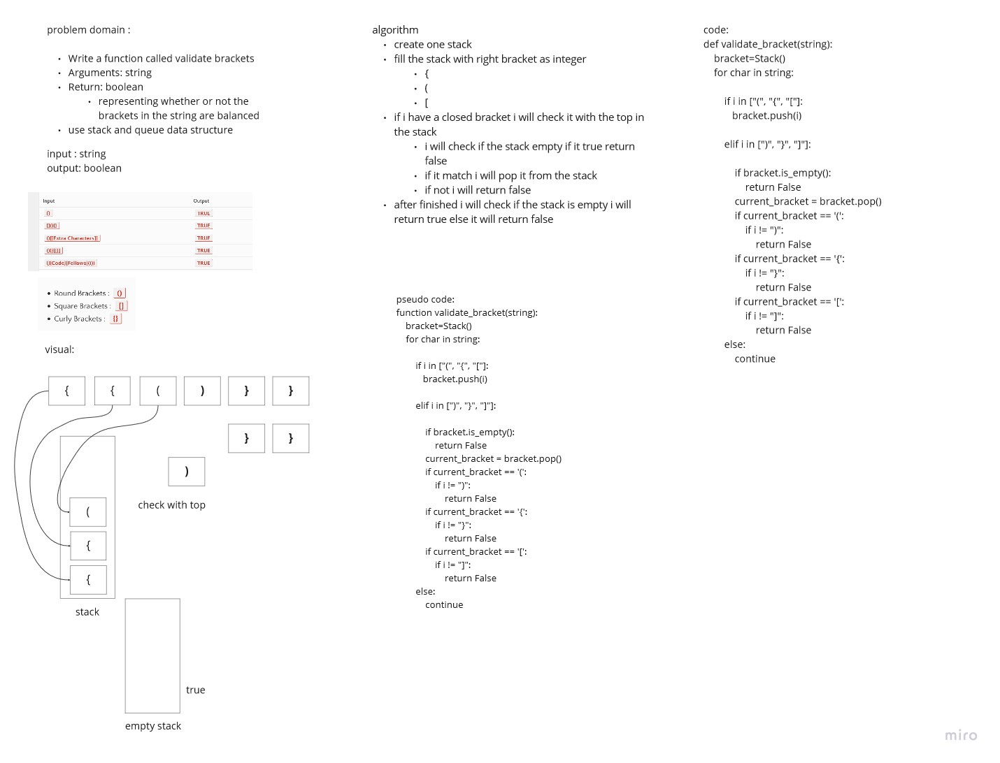

# Challenge Summary
<!-- Description of the challenge -->
Write a function called validate brackets
Arguments: string
Return: boolean
representing whether or not the brackets in the string are balanced
use stack and queue data structure

## Whiteboard Process
<!-- Embedded whiteboard image -->

## Approach & Efficiency
<!-- What approach did you take? Why? What is the Big O space/time for this approach? -->

using one for loop to move inside the string and use a stck to save the open bracket inside it
so the time complixity for the big o notation is O(n)
for the space complixity it O(n)  

## Solution
<!-- Show how to run your code, and examples of it in action -->
I construct a stack to save the open bracket in it " "(", "{", "[" " and when the string give me close bracket " ")", "}", "]" " I will check it with the top of stack if it equal I will pop it from the stack and continue the looping after finishing the looping the stack should be empty if it not I will return False
